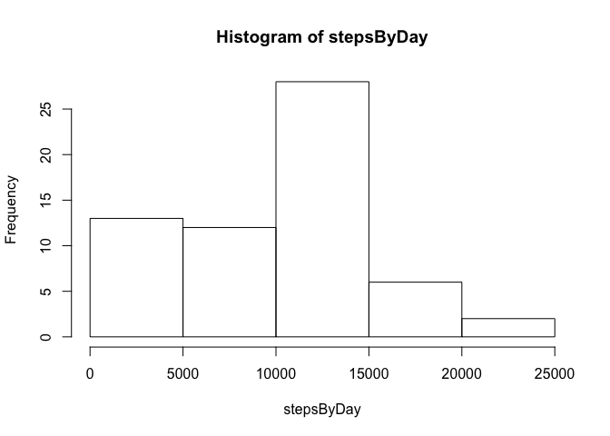
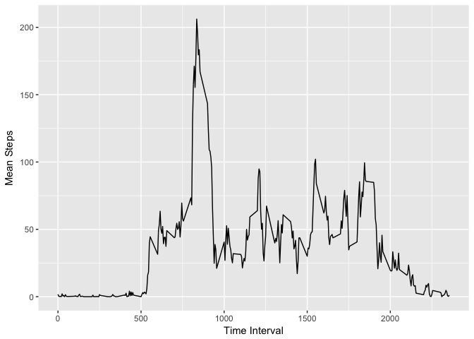
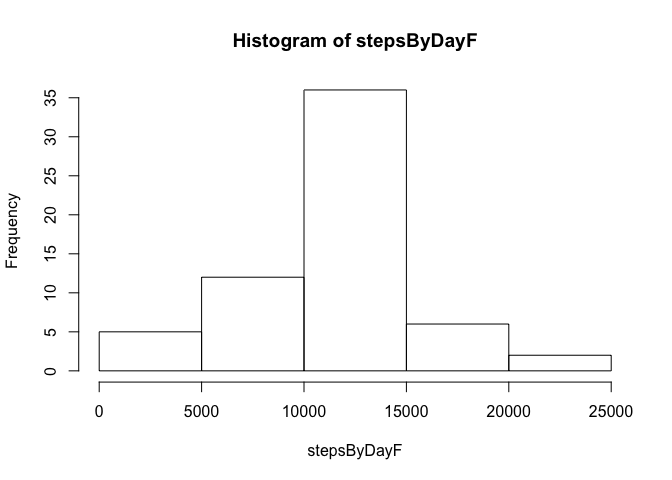
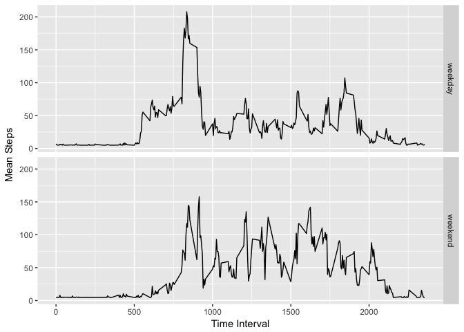

## Loading and preprocessing the data

This part load neccessary libraries, load data from CSV file and do preprocessing before further analysis:


```r
library(ggplot2)
library(scales)
library(Hmisc)
```

```
## Loading required package: lattice
```

```
## Loading required package: survival
```

```
## Loading required package: Formula
```

```
## 
## Attaching package: 'Hmisc'
```

```
## The following objects are masked from 'package:base':
## 
##     format.pval, units
```

```r
setwd("/Users/pawelpiwowarski/Coursera/JH-RR/Project 1/")
print(getwd())
```

```
## [1] "/Users/pawelpiwowarski/Coursera/JH-RR/Project 1"
```

```r
activity=read.csv("activity.csv")
summary(activity)
```

```
##      steps                date          interval     
##  Min.   :  0.00   2012-10-01:  288   Min.   :   0.0  
##  1st Qu.:  0.00   2012-10-02:  288   1st Qu.: 588.8  
##  Median :  0.00   2012-10-03:  288   Median :1177.5  
##  Mean   : 37.38   2012-10-04:  288   Mean   :1177.5  
##  3rd Qu.: 12.00   2012-10-05:  288   3rd Qu.:1766.2  
##  Max.   :806.00   2012-10-06:  288   Max.   :2355.0  
##  NA's   :2304     (Other)   :15840
```

## What is mean total number of steps taken per day?

1. Calculate the total number of steps taken per day

```r
stepsByDay = tapply(activity$steps, activity$date, sum, na.rm=TRUE)
```
2. Make a histogram of the total number of steps taken each day

```r
hist(stepsByDay)
```

<!-- -->
3. Calculate and report the mean and median of the total number of steps taken per day


```r
meanSteps=mean(stepsByDay)
medianSteps = median(stepsByDay)
sprintf("Mean = %f",meanSteps)
```

```
## [1] "Mean = 9354.229508"
```

```r
sprintf("Median = %f",medianSteps)
```

```
## [1] "Median = 10395.000000"
```

## What is the average daily activity pattern?

1. Make a time series plot (i.e. type = "l") of the 5-minute interval (x-axis) and the average number of steps taken, averaged across all days (y-axis)

```r
stepsByInterval = tapply(activity$steps, activity$interval, mean, na.rm=TRUE)
timeSeries <- aggregate(x=list(meanStep=activity$steps), by=list(interval=activity$interval), FUN=mean, na.rm=TRUE)
ggplot(timeSeries, aes(interval, meanStep)) + geom_line()+xlab ("Time Interval")+ylab("Mean Steps")
```

<!-- -->
2. Which 5-minute interval, on average across all the days in the dataset, contains the maximum number of steps?

```r
mostSteps <- which.max(timeSeries$meanStep)
timeMostSteps <-  gsub("([0-9]{1,2})([0-9]{2})", "\\1:\\2", timeSeries[mostSteps,'interval'])
sprintf("5-minutes interval with most steps: %i",mostSteps)
```

```
## [1] "5-minutes interval with most steps: 104"
```

## Imputing missing values

1. Calculate and report the total number of missing values in the dataset (i.e. the total number of rows with ????????s)

```r
missingValues <- length(which(is.na(activity$steps)))
sprintf("Number of missing values: %i",missingValues)
```

```
## [1] "Number of missing values: 2304"
```
2. Devise a strategy for filling in all of the missing values in the dataset. The strategy does not need to be sophisticated. For example, you could use the mean/median for that day, or the mean for that 5-minute interval, etc.
I used simplest strategy, it means mean of steps.

3. Create a new dataset that is equal to the original dataset but with the missing data filled in.

```r
activityF = activity

activityF$steps <- impute(activity$steps, fun=mean)
```

4. Make a histogram of the total number of steps taken each day and Calculate and report the mean and median total number of steps taken per day. Do these values differ from the estimates from the first part of the assignment? What is the impact of imputing missing data on the estimates of the total daily number of steps?

```r
stepsByDayF = tapply(activityF$steps, activityF$date, sum, na.rm=TRUE)
hist(stepsByDayF)
```

<!-- -->

```r
meanStepsF=mean(stepsByDayF)
medianStepsF = median(stepsByDayF)
sprintf("Mean = %f",meanStepsF)
```

```
## [1] "Mean = 10766.188679"
```

```r
sprintf("Median = %f",medianStepsF)
```

```
## [1] "Median = 10766.188679"
```
## Are there differences in activity patterns between weekdays and weekends?

```r
wd = ifelse(weekdays(as.Date(activityF$date,'%Y-%m-%d')) %in% c('Sunday','Saturday'),'weekend','weekday')
```

```
## Warning in strptime(x, format, tz = "GMT"): unknown timezone 'zone/tz/
## 2017c.1.0/zoneinfo/Europe/Warsaw'
```

```r
activityF = cbind(activityF,wd)
timeSeriesF <- aggregate(steps~interval + wd,activityF, FUN=mean, na.rm=TRUE)
ggplot(timeSeriesF, aes(interval, steps)) + facet_grid(wd ~ .) + geom_line()+xlab ("Time Interval")+ylab("Mean Steps")
```

<!-- -->
